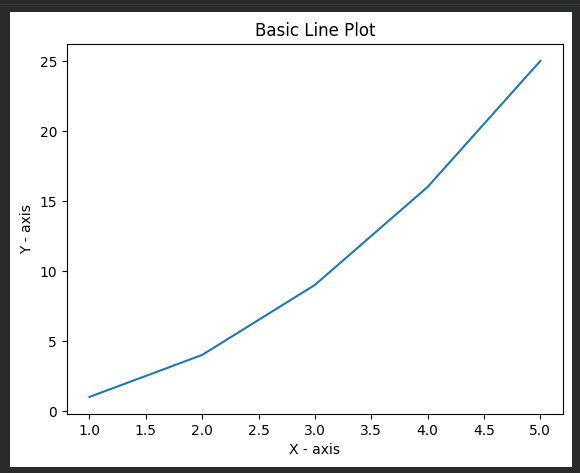
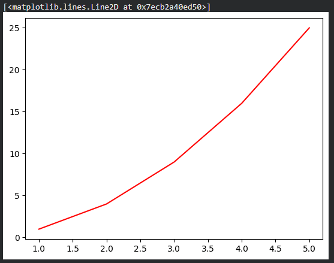
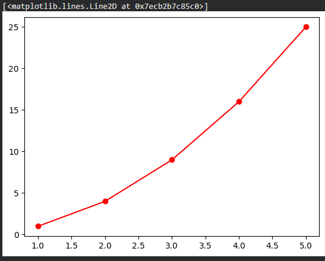
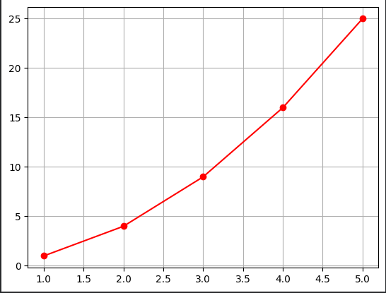
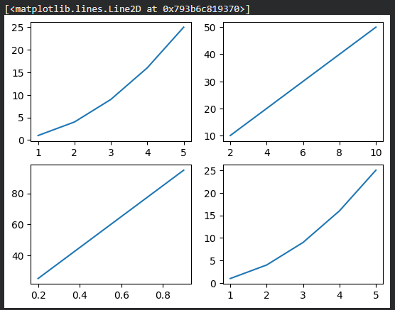
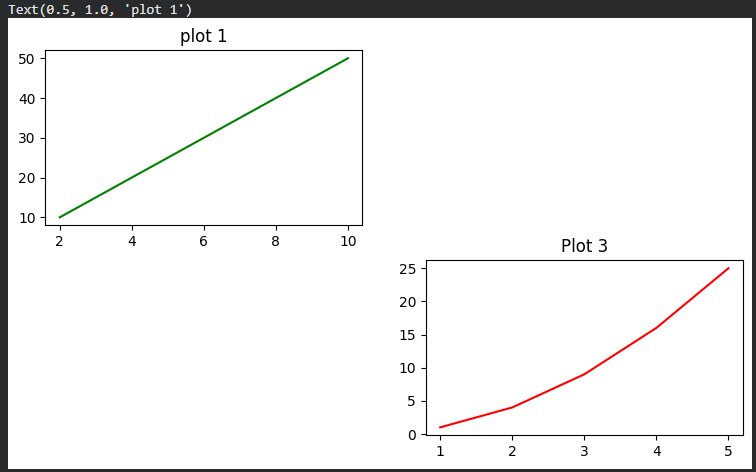
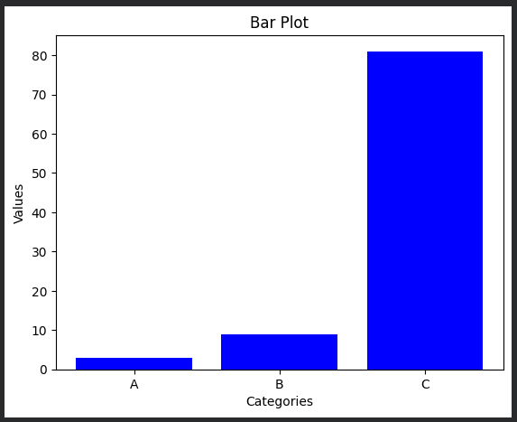
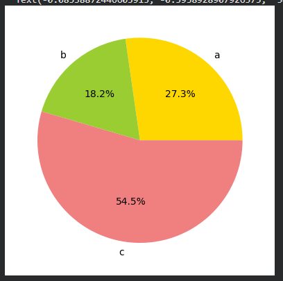
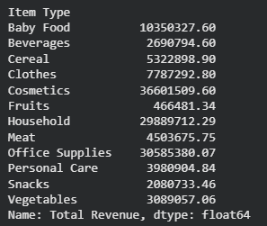
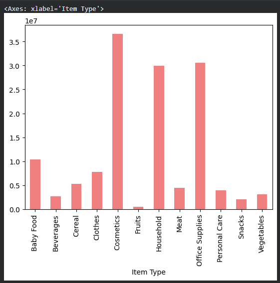

# Data Analysis with Python :

## `NUMPY` :
- fundamental library for scientific computing in python. 
- provides support for :
    - arrays
    - matrices
- collection of mathematical functions to operate on them

 ## ` WHY NUMPY` :
- They are faster
- NumPy stores only one type of data together, so memory is saved.
- They allow mathematical operations directly
- They are used in fields like Machine Learning, Data Science, Artificial Intelligence, Deep Learning, Image Processing.

```py
!pip install numpy
```

```py
import numpy as np

# create array using numpy 
## 1d array :

one_d_array = np.array([1, 2, 3, 4, 5])
print(one_d_array)
print(type(one_d_array))
print(one_d_array.shape)

one_d_array.reshape(1, 5)

print(one_d_array.shape)

two_d_array = np.array([[1, 2, 3, 4,5], [1, 2, 3, 4, 5]])

one_d_array_in_range = np.arange(0, 10, 2) # ([0, 2, 4, 6, 8])

one_d_array_in_range.reshape(1, 5) # ([0],[2],[4],[6],[8],[10])
```

- Identity Matrix :
`np.eye(3)` -- 3-by-3 identity matrix

- All Ones in the matrix :
`np.ones(2,3)` -- All ones in 2-by-3 matrix

- All twos :
`np.twos(3,4)` -- All 2s in 3-by-4 matrix

### Attributes of NumPy  Array :

```py
arr = np.array([[1, 2, 3], [4, 5, 6]])

arr.shape # op = (2, 3) -- (rows, cols)
arr.ndim # no. of dimensions either 1, 2 or 3
arr.size # number of elements
arr.itemsize # size of items in bytes
arr.dtype # datat type of the elements

```

### Numpy Vectorized Operations :

```py
# First lets create 2 arrays to operate upon :

arr1 = np.array([1, 2, 3, 4, 5])
arr1 = np.array([4, 5, 6, 7, 8])

## Element wise Addition, Subtraction, Multiplication, Division :

arr3 = arr1 + arr2
arr3 = arr1 - arr2
arr3 = arr1 * arr2
arr3 = arr1 / arr2

## Universal Functions :

arr = np.array([2, 3, 4, 5, 6 ])

np.sqrt(arr) # Square root
np.exp(arr) # exponentiation
np.sin(arr) # sine of array 
np.log(arr) # log of the elements

## Array Slicing and Indexing :

arr = np.array([[1, 2, 3],[1, 2, 3],[4, 5,6 ]])

arr[0][2]

arr[1:, 2:] or arr[1:3][2:]
```

### Statistical Concepts -- Normalisation :

```py
# mean :
mean = np.mean(data)

# median :
median = np.median(data)

# Standard deviation :
std_dev = np.std(data)

# Variance :
variance = np.var(data)
```

### logical operations :

```py
data = np.array([1, 2, 3, 4, 5, 6, 7, 8, 9, 10])
data[(data > 5) & (data < 8)]
```

### Sorting in NumPy
-We can sort elements of a NumPy array using np.sort().

-Sorting a 1D array
```py
import numpy as np

unsorted = np.array([4, 3, 7, 5])
print(np.sort(unsorted))
```
-Sorting a 2D array
```py
arr_2d = np.array([[1, 2, 3], [6, 7, 3]])
print(np.sort(arr_2d))                  # sorts row-wise (axis = 1)
print(np.sort(arr_2d, axis = 0))        # sorts column-wise (axis = 0)

```
###Axis Concept 
-Each dimension in a NumPy array is called an axis.
-Axes are numbered starting from 0.

|Type of array	|No. of axes	| Meaning                                       |
|---------------|---------------|-----------------------------------------------|
|1D array	    |1 axis	        |axis 0                                         |
|2D array	    |2 axes	        |axis 0 → rows, axis 1 → columns                |
|3D array	    |3 axes	        |axis 0 → depth, axis 1 → rows, axis 2 → columns|


### Easy Trick to Remember (IMP)

|Axis	   | Direction                     |
|----------|-------------------------------|
|axis = 0  |Down the rows (vertical)       |
|axis = 1  |Across the columns (horizontal)|

## Example visualization

axis 0 ↓ (vertical)
[ 1  2  3 ]
[ 4  5  6 ]
   → axis 1 → (horizontal)
---
## Pandas - Dataframe and Series :

- powerful data manipulation library
- used for data analysis and data cleaning

- 2 primary Data Structures :
    1. Series
    2. Dataframe

#### Series : 
- 1-Dimensional array-like object

```py
!pip install pandas

import pandas as pd

data = [1, 2, 3, 4, 5]
series = pd.Series(data)

data_dict = {'a' : 1, 'b' : 2, 'c' : 3}
series_dict  = pd.Series(data_dict)

data_val = [1, 2, 3, 4, 5]
data_index = ['a', 'b', 'c', 'd', 'e' ]

series_index = pd.Series(data_val, index = data_index)

```

#### DataFrame :
- 2-dimensional
- size-mutable
- potentially heterogeneous tabular data structure
- labeled rows and cols

```py
# Creating a dataframe from a dictionary :

data_dict = {
    'name' : ['Krish', 'John', 'Jack'],
    'Age' : [25, 30, 40],
    'city' : ['Pune', 'Goa', 'Florida']
}

df = pd.DataFrame(data_dict)
print(df)
print(type(df))

# Creating a Data Frame from a List of dictionaries

data = [
    {'name' : 'Krish', 'city' : 'pune' },
    {'name' : 'Jack', 'city' : 'Florida' }
]

df = pd.DataFrame(data)
```

#### Reading data from csv file :

```py
df = pd.read_csv('salesdata.csv')
df.head(5) # prints the top 5 elements in the dataframe
df.tail(5) # prints the last 5 elements in the dataframe
```

#### Accessing data from DataFrame :

```py
df['name'] # returns column (type -- Series)

df.loc[0] # Row location

df.iloc[0] # integer based indexing -- Column location

df.iloc[0][0] # returns the single element

df.at[1, 'age'] # 1st indexed elementsin column 'age'

df.iat[2,2] # elements at 2nd index in row, 2nd index in column
```

### Data Manipulation with DataFrame :

```py
df['salary'] = [5000, 6000, 7000]

df.drop('salary') # will return error, because default value of axis is zero representing row

df.drop('salary', axis = 1, inplace = True) # deletes the column named 'salary'
# inplace is used for permanent changes in dataframe.

# Increment every value in a column :
df['age'] = df['age'] + 1

```

### Dataframe attributes :

```py
df.describe() # Statistical summary of the dataframe

df.dtypes # Data types of every column

```


# Data Manipulation and Analysis with `Pandas` library :

### Handling Missing values

```py
df.isnull().any(axis=1)

df.isnull().sum()

df['sales_new'] = df['sales'].fillna(df['sales'].mean()) 

new_df = df.fillna(0.0)
```

### Renaming columns :
```py
df = df.rename(columns = {'salary' : 'new_salary'})
```

### Changing data types

```py
df['value_new'] = df['value'].astype(int)
# -- chnages from its tyoe to int
```

### `apply()` function in pandas :

```py
df['new value'] = df['value'].apply(lambda x : x*2)
# applies a custom function to each and every value.
```

## Data Aggregating and Grouping :

```py
grouped_mean = df.groupby('Product')['value'].mean()
# groups acc. to column - product, the mean of the column value

# we can also group them based on 2 categories :
grouped_by_2_columns = df.groupby(['Product','region'])['value'].sum()
```

#### Outputs :

|Product	   |                      |
|----------|-------------------------------|
|product 1  | 46.111       |
|product 2  | 96.341       |
|product 3  | 49.111       |

|Product    |  Region     |             |
|-----------|-------------|-------------|
|product 1  | east        |49.111       |
|           | west        |49.111       |
|           | north       |49.111       |
|           | south       |49.111       |
|product 2  | east        |49.111       |
|           | west        |49.111       |
|           | north       |49.111       |
|           | south       |49.111       |
|product 3  | east        |49.111       |
|           | west        |49.111       |
|           | north       |49.111       |
|           | south       |49.111       |

### Multiple Aggregate functions :

```py
grouped_by = df.groupby('Region')['value'].agg(['mean', 'sum', 'count'])
```

#### Output :

|Region      |  mean     |   sum       | count    |
|------------|-----------|-------------|----------|
| east       | east      |49.111       |  13      |
| west       | west      |49.111       |  09      |
| north      | north     |49.111       |  25      |
| south      | south     |49.111       |  67      |

### Merging and Joining DataFrames :
- `merge()` function in pandas is same as that of `JOIN` in `SQL`.
- Parameters of `merge()` :
    1. df1
    2. df2
    3. `on` -- `on="Key"`
    4. `how` -- `how = "inner"` 
> `on` represents the column on which we perform join 
> `how` represents the type of JOIN from : INNER, LEFT, RIGHT, OUTER

```py
pd.merge(df1, df2, on="salary", how="inner")
```

## Reading Data from various Data Sources in Pandas :

- From json :
```py
import pandas as pd
from io import StringIO

Data = ' {"name" : {"id" : 1, "roll" : 23}}'

df = pd.read_json(StringIO(Data)) # convert json to the dataFrame
df.to_json() # convert df back to json
df.to_json(orient="record")
```

- from csv URL :
```py
df = pd.read_csv("https://urlpath.in")
df.to_csv("file_location") # convert back to csv
```

- from HTML URL :

```py
df = pd.read_html("https://htmlpath.in")
# It will have to install some dependencies. U will get to know abt those once u run this code. 

df = pd.read_html(url, match = "country", header=0)[0] # [0] is done because a list of tables is returned.
```

- from Excel file :
    - You will have to install the `openpyxl` for this function to work

```py
!pip install openpyxl

df = pd.read_excel('file.xlsx')
```

- convert to pickel_file :

```py
df_excel.to_pickle("df_excel")

# reading pickle files 
pd.read_pickle("filepath")
```

# Data Visualisation with `Matplotlib` :

- `Matplotlib` is a powerful plotting library for python that enables the creation of static, animated, and interactive visualisations. It is widely used for data visualisation in data science and analytics. 

- `!pip install matplotlib`

```py
import matplotlib.pyplot as plt

x = [1, 2, 3, 4, 5]
y = [1, 4, 9, 16, 25]

# create line plot :
plt.plot(x, y)
plt.xlabel( 'X - axis')
plt.ylabel( 'Y - axis')
plt.title("Basic Line Plot")
plt.show()
```

- Output :



- Creating a customised line Plot :

```py
x = [1, 2, 3, 4, 5]
y = [1, 4, 9, 16, 25]

plt.plot(x, y, color = "red") # output 1

plt.plot(x, y, color = "red", linestyle= "-") # output 2

plt.plot(x, y, color = "red", linestyle= "-.") # output 3

plt.plot(x, y, color = "red", linestyle= "-", marker="o", linewidth=3) # output 4

```
1. output 1 :


2. Output 2 :



3. Output 3 :


4. Output 4 :



```py
plt.grid(True)
```
- Output : 



### Multiple Plots :
- Multiple plots in one window
```py
import matplotlib.pyplot as plt

fig, ax = plt.subplots(2, 2) # 2 rows and 2 cols = 4 plots
fig, ax = plt.subplots(1, 2, figsize= (9,9)) # 1 row and 2 cols = 2 plots
# figsize sets the window size to show plots 

plt.show()
```

- Actually adding values to the subplots :

```py
x1 = [1, 2, 3, 4, 5]
y1 = [1, 4, 9, 16, 25]

x2 = [2, 4, 6, 8, 10]
y2 = [10, 20, 30, 40 , 50]

x3 = [0.2 , 0.4, 0.6, 0.8, 0.9]
y3 = [25, 45, 65, 85, 95]

fig, ax = plt.subplots(2, 2)

# plot in 1st row , 1st col : [0, 0]
ax[0,0].plot(x1, y1)

# plot in 1st row, 2nd col : [0,1]
ax[0,1].plot(x2, y2)

# plot in 2st row, 1nd col : [1, 0]
ax[1, 0].plot(x3, y3)

plt.show()
```

- Output :


#### Setting titles to subplots :

```py
fig, ax = plt.subplots(2,2)

ax[0,0].title.set_text("Title 1") # sets the title for the subplot in 1st row and 1st col
```

#### Shared axes :
- Shared axis sets the same scale for multiple subplots in a window based on an axes and also rows, cols or all
- It is needed when we are plotting similar data but, the plot is of different scale on the axes. 
- So, we need to get the same scale for all the subplots to actually be able to compare these subplots.

```py
fig, ax = plt.subplots(2, 2, sharex="all") # share the scale of x axis, for all subplots
fig, ax = plt.subplots(2, 2, sharex="row") # share the scale of x axis for subplots in same row, for all columns
fig, ax = plt.subplots(2, 2, sharey="col") # share the scale of y-axis for subplots in same cols
fig, ax = plt.subplots(2, 2, sharey="all")
```


| Not Shared axis            | Shared Y-axis                |
|----------------------------|------------------------------|
|  | |
|```py                       | ```py                        |
|fig, ax = plt.subplots(2, 2)| fig, ax = plt.subplots(2, 2, sharey="row")|
|ax[0,0].plot(x1, y1)        | ax[0,0].plot(x1, y1)         |
|ax[0,1].plot(x2, y2)        | ax[0,1].plot(x2, y2)         |
|ax[1,0].plot(x3, y3)        | ax[1,0].plot(x3, y3)         |
|ax[1,1].plot(x1, y1)        | ax[1,1].plot(x1, y1)         |
|```                         |```                           |

### Multiple Plots by Krish Naik : (Another Method)
- we have used the `subplots()` method
- But, now we will use the `subplot()` method :
- so with that, the title  method also changes.
- We used to do `ax[0, 1].title.set_text("Title 1")`,
    - Now, we just do `plt.title("Title 1")`.

```py
plt.figure(figsize = (9,5))

plt.subplot(2, 2, 4) # It suggests that there are 2 rows, 2 cols and in these we have to fit the 3rd graph
plt.plot(x1, y1, color="red")
plt.title("Plot 3")

plt.subplot(2, 2, 1) # it suggests the 1st subplot in the 2-by-2 plot arrangement
plt.plot(x2, y2, color="green")
plt.title("plot 1")

```

Output : 



## Bar plots in Matplotlib :

- Bar plots in matplotlib are the graphs present in the form of bar graphs.
- We need to import the same as before.

```py
import matplotlib.pyplot as plt

categories = [ 'A', 'B', 'C' ]
values = [3, 9, 81]

plt.bar(categories, values, color="blue")
plt.xlabel('Categories')
plt.ylabel('Values')
plt.title('Bar Plot')
plt.show()

```

Output : 



## Histograms in Matplotlib :
- Histograms are used to represent the distribution of a dataset. They divide the data into bins and count the number of data points in each bin.

```py
# Sample data 
data = [1, 2, 2, 3, 3, 2, 4, 3, 5, 5, 4, 5, 3, 1, 2, 4, 4, 3, 5, 3]

# Create Histogram 
plt.hist(data, bins=5, color="green", edgecolor="black")
```

Output :


### Create a scatter plot :

```py
x = [1, 2, 3, 4, 5]
y = [2, 4, 6, 8, 0]

plt.scatter(x, y, color="green", marker = "o")
```

Output :


### Pie Charts :

```py
labels = ['a', 'b', 'c']
sizes = [30, 20, 60]
colors = ['gold', 'yellowgreen', 'lightcoral']
explode = (0.2, 0, 0)
plt.pie(sizes, labels=labels, colors=colors, autopct="%1.1f%%")
```

Output :



- using one more attrinute : `explode` :
- It take that piece out of the pie chart 
`plt.pie(sizes, explode=explode, labels=labels, colors=colors, autopct="%1.1f%%")`

Output :


## Practical examples in Matplotlib :

### Sales Data Visualisation :

```py
import pandas as pd

sales_data_df = pd.read_csv(file_name)

## Plot total sales by products :
total_sales_by_category = sales_data_df.groupby('Item Type')['Total Revenue'].sum()
print(total_sales_by_category)
```

Output will be just text data :



- But if we were to represent this data visually :

```py
import pandas as pd

sales_data_df = pd.read_csv(file_name)

## Plot total sales by products :
total_sales_by_category = sales_data_df.groupby('Item Type')['Total Revenue'].sum()
print(total_sales_by_category)

total_sales_by_category.plot(kind="bar", color="lightcoral")
```

Then the output is :



