# Probability :
    It is about determining the likelihood of an event.
    
    Example -- Tossing a coin and possibility of getting a head is 50%.

### Mutual Exclusive Events :
    2 Events are mutual exclusive if they cannot occur at the same time.

    Example : tossing a coin -- we can not get `head` and `tail` at the **same** time.

### Non-Mutual Exclusive Events :
    2 Events are non-mutual exclusive if they can occur at the same time.

    Example : Deck of cards -- we can get a `k` and a `heart` at the same time.

## Addition Rule :

- Addition Rule for mutual exclusive event :

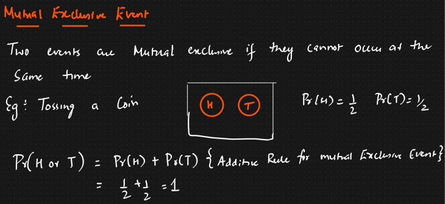

- Addition Rule for non-mutual exclusive event :

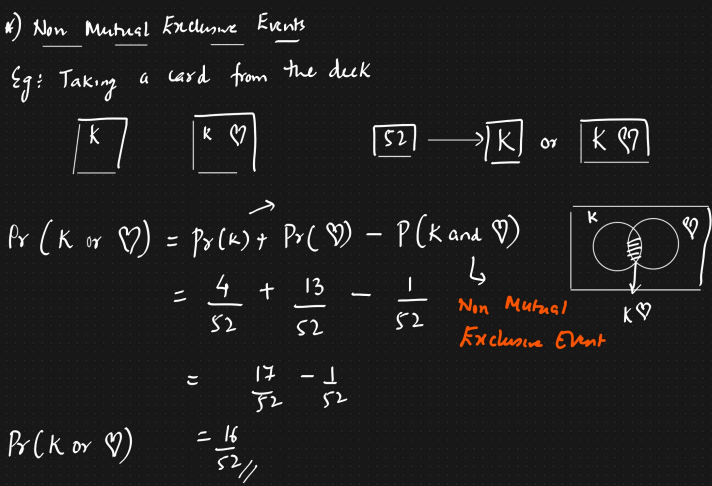

## Multiplication Rule :

### Independent Events :
    2 Events are independent if their occurrence do not affect each other.

    Example -- Tossing a coin, Rolling a dice

### Dependent Events :
    2 Events are dependent if their occurence directly affect each other.

    Example : Take out a king card from the deck and after that, we get a queen card at the deck.

- Multiplication rule for independent event :

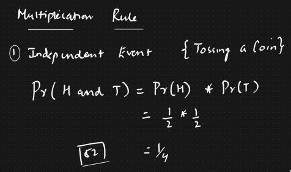

- Multiplication rule for dependent event :
    - idea towards Bayes theorem (conditional probability)

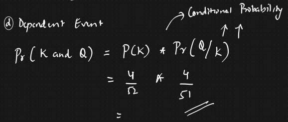

# Probability Distribution Functions :
    Probability distribution function describe how the probabilities are distributed over the values of a random variable.

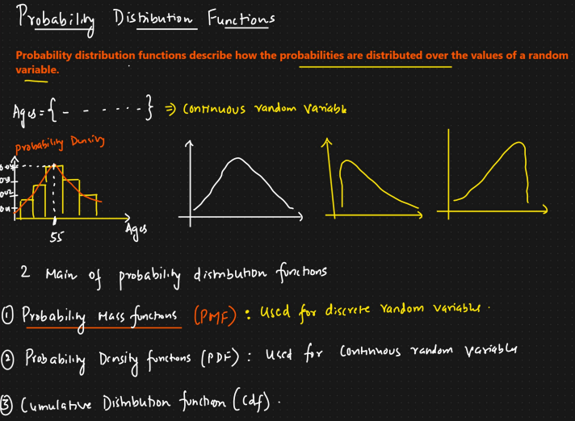

### 3 main types of probability distribution function :
    1. PMF -- Probability Mass Function
    2. PDF -- Probability Density Function
    3. CDF -- Cumulative Distribution Function

### 1. PMF :
    Used for Discrete random variable.

    Example - Rolling a dice (fair dice)

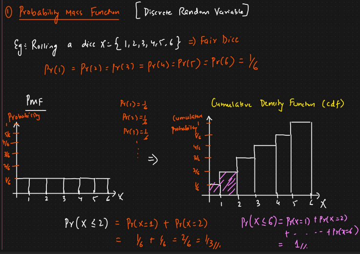

### 2. PDF :
    Used for continuous random variables

    It is the gradient (derivative) / slope of the cumulative curve.

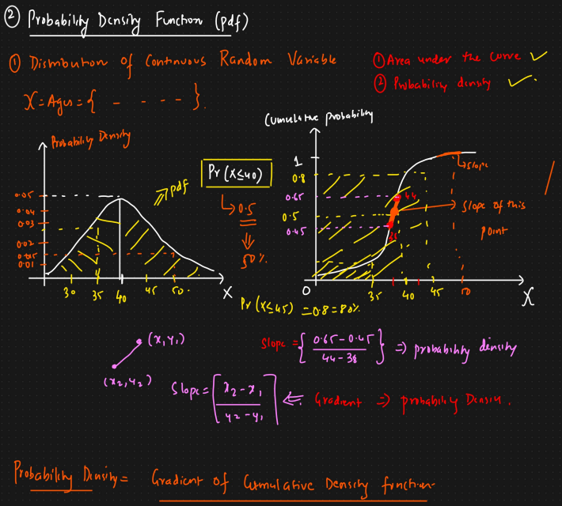

#### Properties of PDF :
    1. It is non-negative `f(x) >= 0` for all values
    2. Total area under the curve is equal to 1

## Types of Probabilty Distributions :
    1. Bernoulli Distribution -> (pmf)
    2. Binomial distribution -> (pmf)
    3. Normal/ guassian distribution -> (pdf)
    4. Poisson Distribution -> (pmf)
    5. Log Normal distribution -> (pdf)
    6. Uniform distribution -> (pmf)
    7. Power law distribution
    8. Pareto distribution

- As a data scientist, you will be given a dataset abt house price, number of rooms, location of the house, floor, sea side. 
- Some of these features are discrete, whereas some will be continuous.
- So, based on different distributions, we can make a lot of assumptions which will fuel `EDA` and `Feature Engg`.

---

### 1. Bernoulli distribution
    The bernoulli distribution is the simplest discrete probability distribution.

    Represents probability distribution of a random variablethat has exactly 2 possible outcomes : [Success, Failure].

    It is used to model binary outcomes such as :
        - coin flip
        - yes/no question
        - whether student will pass/fail

- There are basically 2 parameters : `p` & `q` where `0 <= p <= 1` and `q = 1 - p`
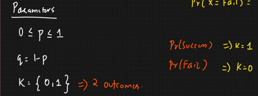

- PMF : 
    - Consider a company launches a new smartphone `A` 
    - Use => `60%`
    - Not Use => `40%`

    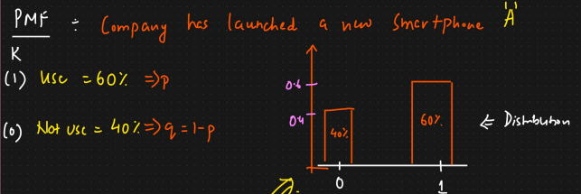

- Mathematical notation of PMF : 


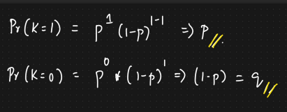

- Mean of bernoulli distribution :
    - expected mean we generally get as the probability of k=1

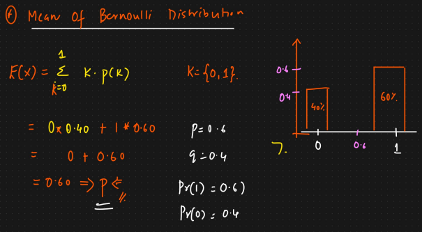

- Median of Bernoulli distribution :

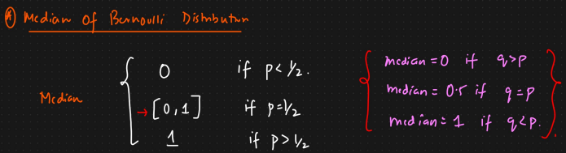

- Mode of Bernoulli distribution :


- Variance :
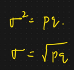

### 2. Binomial Distribution :
    It is the discrete probability distribution of the number of successes in a sequence of n independent experiments, each asking a yes-no question 

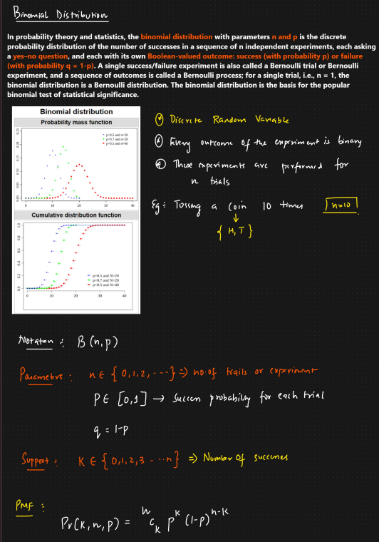

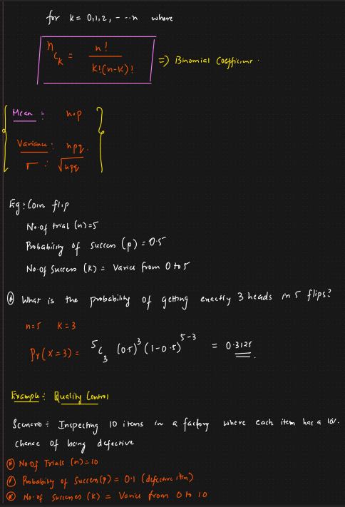

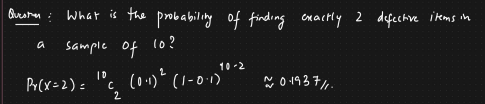

### 3. Poisson Distribution :

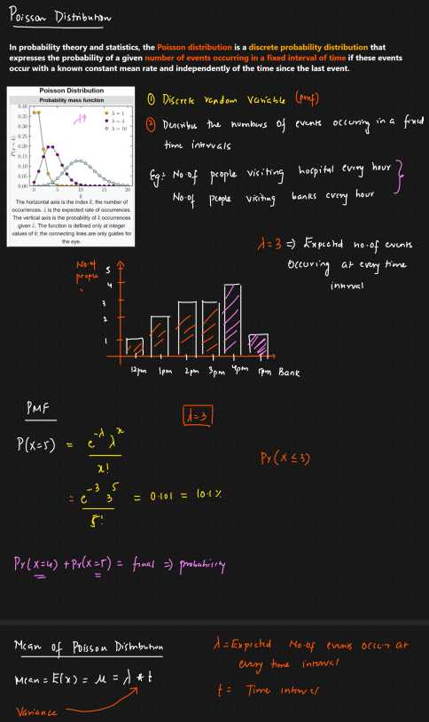

# 📘 Lesson 1: Bernoulli Distribution

(The foundation of almost everything in probability & ML)

### 1️⃣ What problem does Bernoulli solve?
    Bernoulli answers the simplest possible probabilistic question:
    Does an event happen or not?

- There are only two outcomes:
    - Success (1)
    - Failure (0)
- No middle ground.

### Real-world examples
    Email is spam (1) or not spam (0)

    User clicks an ad (1) or doesn’t click (0)

    Loan defaults (1) or doesn’t default (0)

    Machine fails today (1) or works fine (0)

> If your outcome can be encoded as `yes/no`, `true/false`, `1/0` → **Bernoulli** is involved.

## 2️⃣ Formal definition (with formula)

A random variable X follows a Bernoulli distribution if:
```
X ∈ {0,1}
```
with probability:
```
P(X=1)=p
P(X=0)=1−p
```

We write:
`X∼Bernoulli(p)`

- Key parameters :
    - p = probability of success
    - There is only one parameter

### 3️⃣ Mean & Variance (important for ML intuition)
#### Mean (Expected Value)
    E[X]=p

    👉 Interpretation:
    If you repeat the experiment many times, the average outcome tends to p.

- Example:
    - If p = 0.8, then over many trials, ~80% outcomes are 1.

#### Variance
    Var(X)=p(1−p)

👉 **Insights**:

> Maximum variance occurs at p = 0.5

> If p is near 0 or 1 → outcomes are predictable

> This idea shows up directly in classification confidence

### 4️⃣ How does the graph look? 
    The x-axis has only two points: 0 and 1

    At x = 1, height = p

    At x = 0, height = 1 − p

> 📌 There is no curve — just two bars


### 5️⃣ Why Bernoulli matters for problem solving

    Ask yourself:

    “Is this a single decision with two outcomes?”

    If yes → start with Bernoulli

- This helps you:
    - Choose the right loss function
    - Interpret model outputs correctly- 
    - Understand uncertainty

### 6️⃣ Bernoulli in Data Science (Real usage)
#### 📊 Data Analysis (EDA)

    Binary columns: is_fraud, clicked, passed_exam

    You estimate p as:
    𝑝 = number of 1s / total samples
	​

#### 🤖 Machine Learning

    Bernoulli is the heart of binary classification.

    Example: Logistic Regression

    Model outputs P(Y=1 | X) → that’s p

    Target variable follows a Bernoulli distribution

- That’s why:
We use Binary Cross-Entropy loss
Predictions are probabilities, not hard labels

#### 🧠 Decision Making

    Suppose:
    Probability of churn = 0.7
    Cost of retention = ₹100
    Cost of losing user = ₹1000
    Bernoulli helps quantify:
    Expected los
    Expected gain
    Whether an action is worth it

#### 7️⃣ Common beginner mistake (important ⚠️)

    ❌ Treating Bernoulli data as continuous
    ❌ Assuming “average = outcome”
    ❌ Forgetting probabilities ≠ certainty

- Example:
    - Model predicts 0.9
    - Outcome can still be 0
    - Probability ≠ guarantee.

### 8️⃣ Bridge to next distribution

- Bernoulli answers:
    - “What happens in one trial?”

- Next logical question:
    - “What happens if I repeat this experiment n times?”

> ➡️ That leads directly to Binomial Distribution 🎯

## ✅ Summary (lock this in)
    Bernoulli = single yes/no experiment
    Parameter: p
    Mean = p, Variance = p(1−p)
    Foundation of binary classification
    Used everywhere in ML, analytics, and decision systems

# 📘 Lesson 2: Binomial Distribution
    (Counting how many successes happen)

## 1️⃣ What problem does Binomial solve?
    Binomial answers this question:
    If I repeat the same yes/no experiment n times, how many successes will I get?

    Key idea:
    Bernoulli → one trial
    Binomial → many identical Bernoulli trials

## 2️⃣ Conditions for Binomial (very important ⚠️)
    A problem is Binomial only if all these are true:
        - Fixed number of trials (n)
        - Each trial has two outcomes (success/failure)
        - Probability of success (p) is constant
        - Trials are independent
    
    If even one condition fails, Binomial is wrong.

## 3️⃣ Real-world examples
    Number of users who click an ad out of 100 shown
    Number of defective items in a batch of 50
    Number of heads in 10 coin tosses
    Number of students who pass an exam out of 40

## 4️⃣ Formal definition & formula
Let:

X = number of successes

n = number of trials

p = probability of success per trial

X∼Binomial(n,p)

Probability Mass Function (PMF)
```
P(X=k) = (kCn)p^k.(1−p)^n−k
```
### What each term means (intuition)
    (𝑛C𝑘) : Number of ways to choose k successes from n trials

    𝑝^𝑘 : Probability of k successes

    (1−p)^n−k : Probability of failures

    👉 Binomial = combinatorics + probability

## 5️⃣ Mean & Variance (pattern recognition)
    Mean : E[X]=np

    Interpretation:
    Expected number of successes in n trials

### Variance
    Var(X) = np(1−p)

    Insights:
        - Variability increases with n
        - Same uncertainty structure as Bernoulli, just scaled

## 6️⃣ How does the graph behave?
    X-axis: number of successes (0 to n)
    Y-axis: probability
    Shape depends on p

    Cases:
        p = 0.5 → symmetric bell-like shape
        p < 0.5 → skewed right
        p > 0.5 → skewed left
        As n increases, the distribution:
        Becomes smoother
        Starts looking Normal (important later!)

## 7️⃣ Why Binomial improves problem solving

    Ask:
    “Am I counting how many times something happens?”

    If yes → Binomial

- Examples:
    - “How many will click?”
    - “How many will fail?”
    - “How many will convert?”

## 8️⃣ Binomial in Data Science
### 📊 Exploratory Data Analysis

    Conversion rate analysis
    A/B testing
    Survey responses

- Example:
    - 200 users shown an ad
    - 40 click → estimate p = 0.2
    - Binomial models uncertainty in that estimate

### 🤖 Machine Learning

    Loss functions for classification
    Evaluation metrics like accuracy are binomial-based
    Logistic regression predictions aggregated over samples

### 🧠 Decision Making

    Example:

    Expected number of failures = np
    Helps plan inventory, staffing, or risk buffers

### 9️⃣ Common mistakes ⚠️

    ❌ Using Binomial when trials aren’t independent
    ❌ Changing p mid-experiment
    ❌ Using Binomial for time-based events (that’s Poisson!)

## 🔗 Bridge to next distribution

- Binomial assumes:
    - Fixed number of trials

- Next question:
> “What if events happen over time or space, not in fixed trials?”

> ➡️ That leads to **Poisson Distribution** ⏱️

## ✅ Quick summary

    Binomial = count of successes

    Parameters: n, p

    Mean = np

    Used heavily in A/B testing, classification metrics

    Bridge between Bernoulli and Normal


# 📘 Lesson 3: **Poisson Distribution**

*(Modeling how often events happen)*

## 1️⃣ What problem does Poisson solve?

Poisson answers this question:

> **How many times does an event occur in a fixed interval of time or space?**

Key difference from Binomial:

* **Binomial** → fixed number of trials
* **Poisson** → events happen **randomly**, we don’t know how many trials exist


## 2️⃣ Real-world examples

    Number of customer arrivals per hour
    Number of server requests per minute
    Number of accidents per day at an intersection
    Number of emails received per hour
    Number of defects per meter of fabric

These are **rate-based phenomena**.


## 3️⃣ Core assumption (very important ⚠️)

Poisson assumes:

1. Events occur **independently**
2. Events occur at a **constant average rate**
3. Two events **cannot happen at the exact same instant**

If these fail → Poisson fails.


## 4️⃣ Formal definition & formula

Let:

* **X** = number of events
* **λ (lambda)** = average number of events per interval

### Probability Mass Function

### Intuition behind the formula

    (e^λ) : probability of **no events**
    (λ^k) : scales with expected rate
    (k!) : adjusts for ordering

    You don’t memorize this — you **understand when to use it**.

## 5️⃣ Mean & Variance (unique property)

`mean = variance = λ`

🔥 This is special:

* Mean = Variance
* If variance ≫ mean → Poisson is probably wrong

Data scientists use this to **diagnose models**.

## 6️⃣ How does the graph behave?


### Verbal visualization

    X-axis: 0, 1, 2, 3, ...
    Y-axis: probability
    Shape depends on λ

#### Behavior:

* Small λ (e.g., 1): right-skewed, peak near 0
* Medium λ (e.g., 5): skew reduces
* Large λ (>10): looks **almost normal**

📌 This explains why **Normal distribution appears everywhere**


## 7️⃣ Poisson vs Binomial (important contrast)

| Feature    | Binomial | Poisson |
| ---------- | -------- | ------- |
| Trials     | Fixed    | Unknown |
| Time-based | ❌        | ✅       |
| Parameter  | n, p     | λ       |
| Mean       | np       | λ       |

---

## 8️⃣ Poisson in Data Science

### 📊 Data Analysis

    Traffic analysis
    Call center modeling
    Anomaly detection (sudden spike in λ)


### 🤖 Machine Learning

    Poisson regression (for count prediction)
    Modeling clicks, views, failures
    Used in recommender systems & forecasting

### 🧠 Decision Making
    Example:
    - Avg server requests = 100/min
    - What’s the probability of >150 requests?
    - Helps plan **capacity & scaling**

## 9️⃣ Common mistakes ⚠️

    ❌ Using Poisson when rate changes over time
    ❌ Ignoring bursty behavior
    ❌ Using it for proportions instead of counts

## 🔗 Bridge to next distribution

Poisson counts **events**.

Next question:

> “What if measurements cluster naturally around an average?”

➡️ **Normal (Gaussian) Distribution** 🔔
(the backbone of statistics & ML)

## ✅ Summary

    Poisson = event counts per interval
    Parameter: λ
    Mean = Variance = λ
    Used in traffic, failures, demand forecasting


# 📘 Lesson 4: **Normal (Gaussian) Distribution**

*(Why “average” dominates the real world)*

## 1️⃣ What problem does Normal distribution solve?

    Normal answers:
    How do values naturally vary around an average?

    Whenever:
    Many small independent factors influence a value
    No single factor dominates

    👉 The result tends to be **Normal**

This is not magic — it’s the **Central Limit Theorem** working silently.
## 2️⃣ Real-world examples

* Heights of people
* Exam scores
* Measurement errors
* Sensor noise
* Model prediction errors
* Daily temperature variations

If you’ve ever heard:

> “Most values are near the mean”

You’re thinking **Normal distribution**.

## 3️⃣ Formal definition & formula

### Probability Density Function (PDF)


### What parameters mean

    μ (mean) → center
    σ (standard deviation) → spread

## 4️⃣ Mean, Variance & symmetry

    Mean = Median = Mode = μ
    Variance = σ²
    Perfectly symmetric around μ

No skew. No heavy tails.

## 5️⃣ How does the graph behave?


### Verbal visualization

    Bell-shaped curve
    Peak at μ
    Symmetric on both sides

### Empirical Rule (68–95–99.7)

    68% within ±1σ
    95% within ±2σ
    99.7% within ±3σ

This helps with **quick probability estimation**.

## 6️⃣ Why Normal improves problem solving

### Mental shortcut

    Ask:
    “Is this caused by many small independent effects?”

    If yes → try Normal.

## 7️⃣ Normal in Data Science

### 📊 Data Analysis

    Z-scores for outlier detection
    Confidence intervals
    Hypothesis testing


### 🤖 Machine Learning

    Gaussian Naive Bayes
    Assumptions behind linear regression
    Weight initialization
    Noise modeling


### 🧠 Decision Making

    Example:

    Predict delivery time = 30 ± 5 minutes
    Probability of delay > 40 mins?

Normal lets you **quantify risk**.


## 8️⃣ Common mistakes ⚠️

    ❌ Assuming Normal without checking
    ❌ Ignoring skew/heavy tails
    ❌ Applying to bounded data (like probabilities)

## 🔗 Bridge to next distribution

Normal handles **symmetric variation**.

Next question:
> “What if data is always positive and skewed right?”

➡️ **Log-Normal Distribution** 📈

### ✅ Summary

    Normal = natural variability
    Parameters: μ, σ
    Backbone of statistics & ML
    Used everywhere

## (Standard Normal & Z-Score)

## 4️⃣.9 Standard Normal Distribution

The **Standard Normal Distribution** is just a **special Normal distribution**:
Where:

* Mean = **0**
* Standard deviation = **1**

### Why do we need it?

Because:

* Every Normal distribution has **different μ and σ**
* We want **one universal reference distribution**

So we **convert any Normal variable into Z**

---

## 4️⃣.10 Z-Score (Extremely important)

### Formula

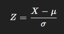

### Interpretation

Z-score answers:

> **How many standard deviations away from the mean is this value?**

---

### Example (real-world)

* Mean exam score = 70
* Std dev = 10
* Student score = 85

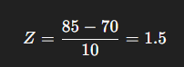

👉 The student is **1.5σ above average**

---

## Why Z-scores matter in Data Science

### 📊 Data Analysis

* Outlier detection
* Feature scaling
* Comparing different metrics on the same scale

### 🤖 Machine Learning

* Gradient descent converges faster
* Models assume normalized inputs
* Distance-based models (KNN, SVM)

### 🧠 Decision Making

* Risk assessment
* Performance benchmarking
* Anomaly detection

---

### Mental model

* Raw value → meaningless alone
* Z-score → **context-aware**

---

## ⚠️ Common mistake

❌ Applying Z-score when data is **not Normal**

---

Now let’s continue the course.

---

# 📘 Lesson 5: **Log-Normal Distribution**

*(Normal — but in log space)*

---

## 1️⃣ What problem does Log-Normal solve?

Log-Normal answers:

> **What if values are always positive and grow multiplicatively?**

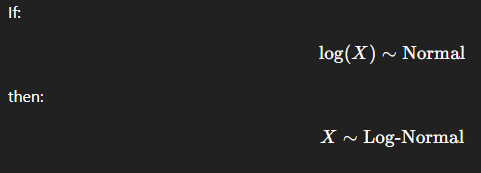

## 2️⃣ Real-world examples

* Income & wealth
* Stock prices
* File sizes
* Session durations
* Response times
* Product sales

These **cannot be negative** and often have **long right tails**

## 3️⃣ Probability density function

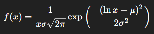

You don’t memorize this — you recognize **when to use it**.

## 4️⃣ How does the graph behave?


### Verbal visualization

* Starts near zero
* Long right tail
* Strong right skew
* Mean > Median > Mode

## 5️⃣ Why Log-Normal improves problem solving

### Ask yourself:

> “Can this value be negative?”
> “Does growth compound?”

If yes → **Log-Normal**

## 6️⃣ Data Science usage

### 📊 EDA

* Transform skewed data using log
* Stabilize variance

### 🤖 ML

* Regression on log-transformed targets
* Financial modeling

### 🧠 Decision Making

* Revenue forecasting
* Risk modeling

## ⚠️ Common mistake

❌ Treating log-normal data as Normal

---

# 📘 Lesson 6: **Uniform Distribution**

*(When everything is equally likely)*

## Definition

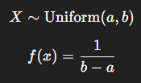

## Real-world examples

* Random number generators
* Sampling
* Shuffling data
* Simulation baselines

## Graph behavior


* Flat rectangle
* No preference
* Constant probability

## Usage in Data Science

* Baseline modeling
* Random initialization
* Monte Carlo simulations

---

# 📘 Lesson 7: **Power Law Distribution**

*(Few dominate, many are small)*

## Core idea

[
P(X = x) \propto x^{-\alpha}
]

## Real-world examples

* City sizes
* Website traffic
* Social media followers
* Earthquakes

## Graph behavior


* Heavy tail
* Scale-free
* No typical average

## Data Science usage

* Network analysis
* Fraud detection
* Rare event modeling

# 📘 Lesson 8: **Pareto Distribution**

*(Concrete form of Power Law)*

## Definition

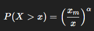

## Real-world examples

* 80–20 rule
* Wealth distribution
* Bug severity

## Graph behavior


## Usage

* Business optimization
* Risk concentration
* Resource allocation

# 🧠 CAPSTONE: Central Limit Theorem (CLT)


## Statement (in plain English)

> **The average of many independent samples tends to be Normal — regardless of the original distribution**


## Why CLT is revolutionary

* Justifies Normal assumptions
* Enables confidence intervals
* Enables hypothesis testing
* Powers most statistics & ML

## Visual intuition

* Raw data → any shape
* Sample means → Normal

## Data Science implications

### 📊 Estimation

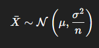

* Larger sample → tighter estimates
* Uncertainty shrinks with data

### 🤖 ML

    Loss convergence
    Model evaluation
    Generalization understanding

### 🧠 Decision Making

    Forecast confidence
    Risk intervals
    A/B testing

# 🧩 Final Mental Map (Extremely Important)

| Problem Type      | Distribution       |
| ----------------- | ------------------ |
| Yes/No            | Bernoulli          |
| Count successes   | Binomial           |
| Events per time   | Poisson            |
| Natural variation | Normal             |
| Compare values    | Z-score            |
| Positive skew     | Log-Normal         |
| Equal randomness  | Uniform            |
| Extreme dominance | Power Law / Pareto |

