# Statistics :

## What is statistics ?
- Statistics is a field that deals with :
    - collection
    - organisation
    - analysis
    - interpretation
    - presentation

- of data.

- At the end of the day, we need to make decision.
    - we make decision based on some kind of data.
    - we need to do the statistical analysis of data and based on the analysis we make decisions.

### Types of Statistics :

- 2 different types of statistics :
    1. **Descriptive** :
        - organising and summarising data 
        - measures of central tendencies 
            - mean 
            - median 
            - mode
        - measures of dispersion - 
            - variance
            - standard deviation

    2. **Inferential** :
        - collect data - make conclusions/inferences using some experiments
            - Ztest 
            - tTest

        - consider a college A -- with data for students height -- {180cm, 170cm, 165cm}
        - total students = 1000
        - sample data of = 200 students
        - so, we can conclude the height of remaining 800 students  by infering using inferential statistics.

### Population data `N` v/s Sample data `n`:
- consider a town with 100K population
- to analyse the data for all people is a hassle.
- so we just take 10k people's data
- this data is called as `sample data`

# Measures of Central Tendency :
    1. Mean
    2. Median
    3. Mode

1. **Mean :** 
    - 

2. **Median :**
    1. Sort the numbers
    2. find the central element
        - if odd elements then central element
        - if even elements then central element is avg of the two mid numbers
    
    - median helps us mitigate the impact of `outliers`.

    - example :
        - consider ages : {1, 3, 2, 4, 5} -- mean = `3`
        - if outlier is present -- {1, 3, 2, 4, 100} -- mean = `22`
        outlier impacts the mean significantly, which is not at all desired.
        - median solves this problem -- median for {1, 3, 2, 4, 100} is `3`.

3. **Mode :**
    - we select element with maximum frequency
    - even though there are outliers, it will not affect the central tendencies that much.

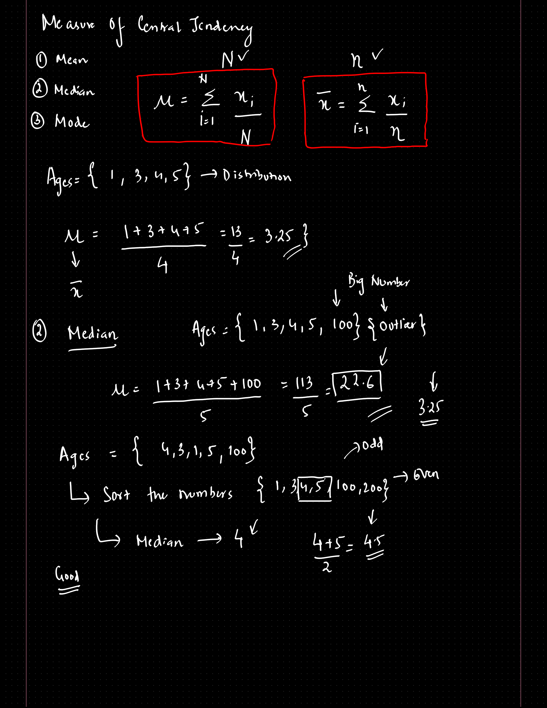

# Measures of Dispersion :
    1. Variance
    2. Standard deviation

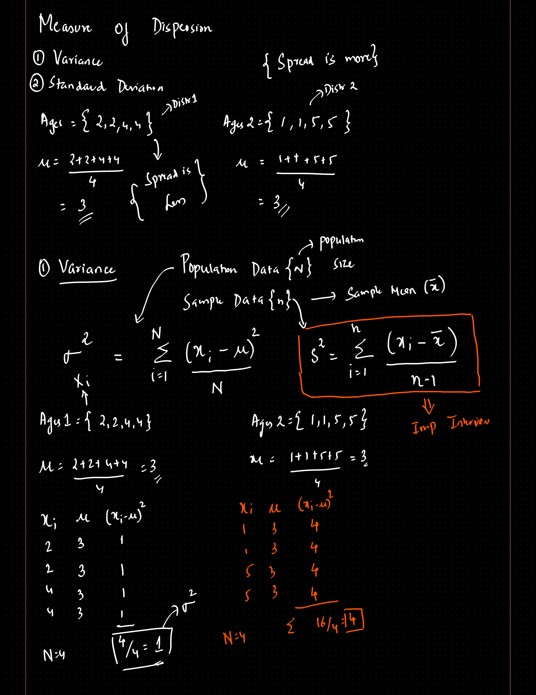

1. **Variance :**
    - example :
        - ages1 = {2, 2, 4, 4} : mean = 3
        - ages2 = {1, 1, 5, 5} : mean = 3
        - here we can see that both has the same mean, but the closeness of actual values varies in both the sets.
        the `ages2` set is more **dispersed** than the `ages1` set

**Interview Question :**
- why is the formula for computing variance for sample data is slightly different than that of population data ?

> we need to make inferences about the population from the sample data. So, if we keep the same formula, we underestimate the true population variance. hence, we need to tak (n - 1) `Bensel's correction`

2. **Standard Deviation :**
    - It suggests that how far is the data element away from the mean.
    - it is simply the square root of variance.

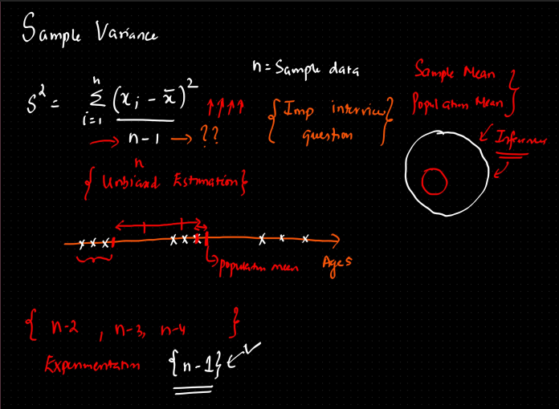

# Variables :

    **Defn :** Variable is a property that can take up any value.

### Different types of variables :

1. **Quantitative**
    1. **Discrete** -- whole number 
        - examples : number of students in a class
    2. **Continuous** -- any fraction
        - example : height, weight
2. **Qualitative / Categorical**
    - example : gender = [Male, Female]
    - Colors = [Red, Green , Blue]

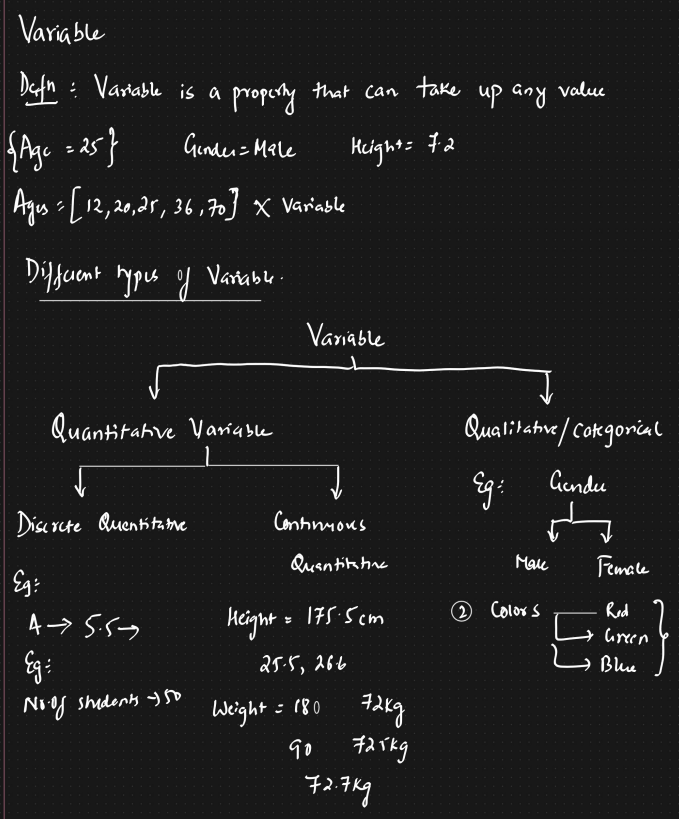

## Random Variables :
    It is a function whose values are derived from different proccesses or experiments

### Different types of random variables :
    1. Discrete -- tossing a coin
    2. Continuous -- how much is it going to rain tomorrow

# Histograms : Descriptive Statistics 

- we have a bin - size. So we count the frequency of the data lying between the range of a bin.
- it represents the number of elements present in a distribution
- we can derive a `probability density function` from a histogram.
- There is a concept called `Kernel Density Estimation` that smoothens the curve of the histogram, this smoothened curve will give the probability distribution function.

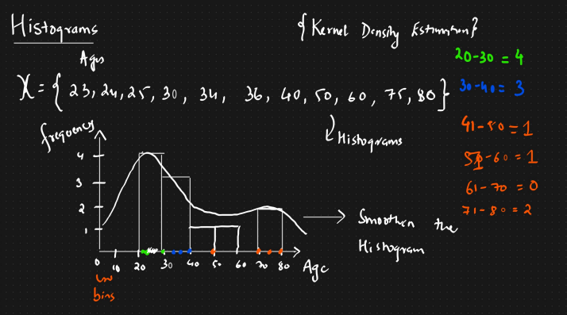

# Percentile :
    A percentile is a value below which certain percentage of distributions lie.

- example :
    - {2, 2, 3, 4, 5, 5, 6, 7, 8, 8, 8, 9, 9, 10}
    - here ,
    - percentile of value `x` = (No. of values below `x`) * 100 / `n`

    - so, percentile of 9 = 11 * 100 / 14 
        - `78.57 %ile`

    - this suggests that, 78.57 % of all the values in the set are less than 9.

### Calculating value back from the percentile :
- Value position = `percentile * (n + 1) / 100`
- this returns a fraction lets say 3.75.
- then identify the 3rd and 4th position in the set, and then take the average of the values.

## Quartiles :
    25%ile -- 1st Quartile
    50%ile -- 2nd Quartile
    75%ile -- 3rd quartile

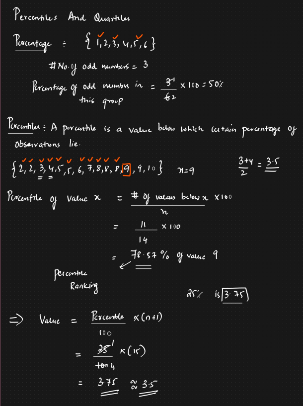
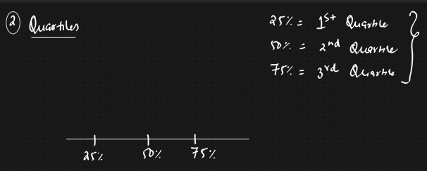

# 5 Number Summary :
    1. Minimum (after removing outliers)
    2. 1st Quartile (`Q1`)
    3. Median
    4. 3rd Quartile(`Q3`)
    5. Maximum (after removing outliers)

- We calculate the :
    1. Lower fence value
    2. Higher Fence Value

> everything **lower than the lower fence value** and **higher than higher fence value** is considered as an outlier.

- Lower fence = Q1 - 1.5(IQR)
- Higher fence = Q3 + 1.5(IQR)
> IQR : Inter Quartile Range = `Q3 - Q1`

- Based on these 5 values we can define a plot called as `Box plot`
> The plot used to identify the outlier is called the box plot.

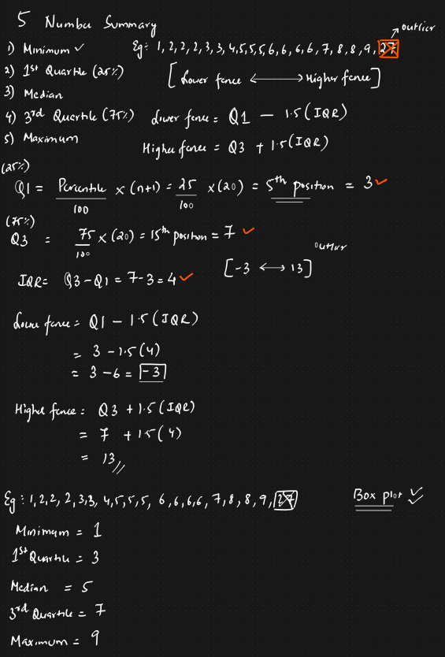

# Covariance and correlation :
    Ovariance and correlation are 2 statistical measures used to determine the relationship between 2 variables.
    Both are used to understand how changes in one variable are associated with another variable.

## Covariance :
    Covariance is a measure of how much 2 random variables change together. 
    
    If the variables tend to increase and decrease together, covariance is **positive**.

    If one tends to increase and other decreases, covariance is **negative**.

    Covariance helps us quantify the relationship between 2 variables.

> cov( x, x ) = var( x )

#### Advantages :
    1. Quantifying Relationships

#### Disadvantages :
    1. Covariance does not have a specific limit value

    2. Value of covariances ranges form `+inf` to `-inf`

    3. If value of a covariance is greater than other, we still can not specify which covariance is stronger.

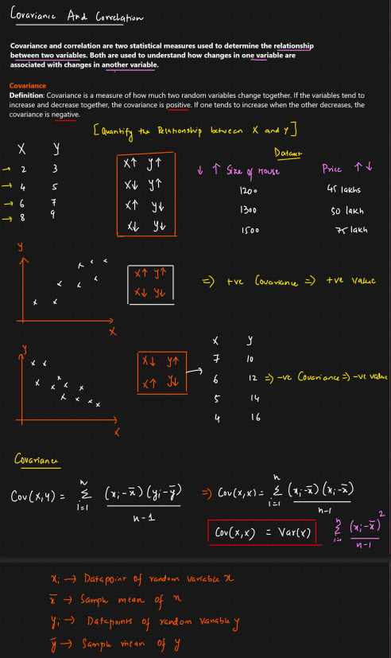

## Correlation 
    1. Pearson correlation coefficient
    2. Spearman Rank correlation

### 1. Pearson Correlation coefficient :
    Limits the value from -1 to 1.

    The more the value towards +1, the more positive correlated x, y are.

    The more the value towards -1, the more negative correlated x, y are.

    However, this is not able to capture the non-linear correlation

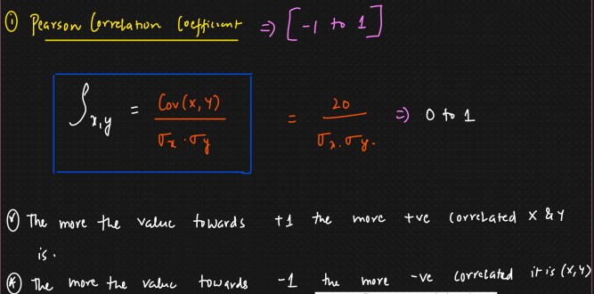

### 2. Spearman Rank Correlation :
    Captures the non-linear correlation to.

    for linear , spearman coefficient is 1 or -1

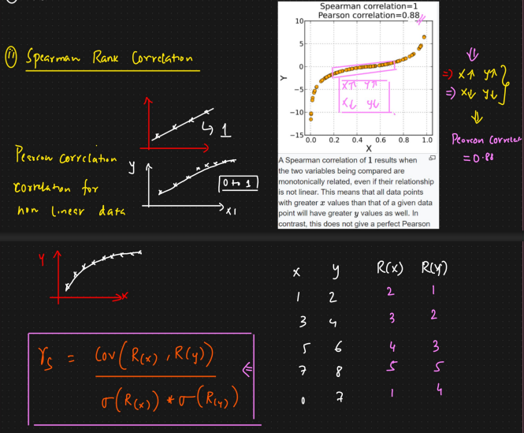

## Feature selection :

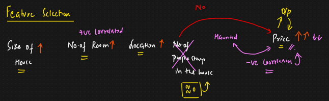

